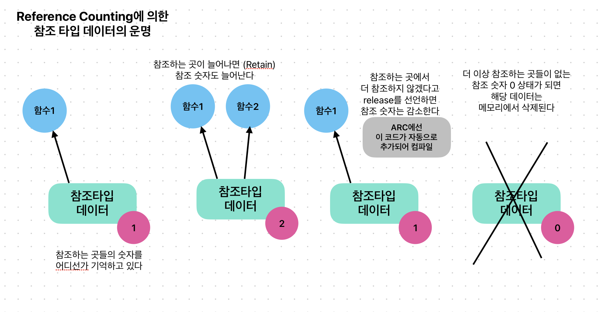

# 자동 참조 카운팅(Auto Reference Counting)

Objective-C 시절부터 존재하던 Reference Counting 개념은 참조타입의 데이터의 운명(life-cycle)을 정하는 방법을 제시합니다. 이 개념은 Swift에도 적용됩니다. 더 이상 참조타입의 데이터를 참조할 존재들이 없어서 그 갯수가 0가 된다면 데이터는 메모리에서 사라집니다.



Obective-C 1.0 시절의 오랜 방식에 따르면 Reference Count를 증가시키고 감소시키는 코드는 모두 수작업으로 우리의 코드에 적혀야 하니다. 만약 참조 숫자를 줄여야할 순간에 release 메서드 같은 적절한 코드를 작성하지 않으면, 해당 데이터는 앱이 종료할 때까지 메모리에서 사라지지 않아서 메모리를 낭비(또는 누수/leak)하게 됩니다.

```objc
//
//  main.m
//  HelloWorld
//
//  Created by Jongwook Park on 7/17/24.
//

/*
 다음의 Swift 코드를 Obejctive-C로 구현해봅시다
 
 class Person {
     var name: String
     var age: Int
     
     init(name: String, age: Int) {
         self.name = name
         self.age = age
     }
 }
 */

#import <Foundation/Foundation.h>

// Person.h
@interface Person : NSObject 
{
    NSString *name;
    int age;
}

- (id)initWithName:(NSString *)aName age:(int)aAge;
- (void)dealloc;
- (void)printInfo;

@end

// Person.m
@implementation Person

- (id)initWithName:(NSString *)aName age:(int)aAge
{
    self = [super init];
    
    if (self) {
        name = aName;
        age = aAge;
    }
    
    return self;
}

- (void)dealloc
{
    [name release];
    [super dealloc];
}

- (void)printInfo
{
    NSLog(@"Name: %@, Age: %d", name, age);
}

@end


// main.m

int main(int argc, const char * argv[]) {
    /*
    @autoreleasepool {
        // insert code here...
        NSLog(@"Hello, World!");
    }
    */
    
    NSAutoreleasePool *pool = [[NSAutoreleasePool alloc] init];
    
    Person *person1 = [[Person alloc] initWithName:@"Ned" age:13];
    [person1 printInfo];
    
    Person *person2 = [person1 retain];
    [person2 printInfo];
    
    // 다음과 같은 release 코드들이 없다면
    // 메모리 낭비가 생길 것이다 (memory leak)
    [person2 release];
    [person1 release];
    [pool drain];
    
    return 0;
}
```

하지만 Objective-C 2.0 무렵 발표된 ARC(Automatic Reference Counting)은 참조 숫자를 줄이는 코드를 우리가 만들지 않고, LLVM 컴파일러가 컴파일하는 과정에서 코드의 적절한 위치에 기능을 추가시킨 뒤 빌드하도록 합니다. 그래서 코드가 더 단순하면서도 문제의 상황을 만들지 않도록 도와줍니다.

```objc
#import <Foundation/Foundation.h>

// Person.h
@interface Person : NSObject 
{
    NSString *name;
    int age;
}

- (id)initWithName:(NSString *)aName age:(int)aAge;
- (void)printInfo;

@end

// Person.m
@implementation Person

- (id)initWithName:(NSString *)aName age:(int)aAge
{
    self = [super init];
    
    if (self) {
        name = aName;
        age = aAge;
    }
    
    return self;
}

- (void)printInfo
{
    NSLog(@"Name: %@, Age: %d", name, age);
}

@end

// main.m

int main(int argc, const char * argv[]) {
    
    @autoreleasepool {
        Person *person1 = [[Person alloc] initWithName:@"Ned" age:13];
        [person1 printInfo];
        
        Person *person2 = person1;
        [person2 printInfo];
    }
    return 0;
}
```

Swift는  ARC 개념을 포함해 LLVM 컴파일러를 활용하기 때문에, 실제 우리 Swift 코드에서도 release와 같은 메서드를 작성해줄 필요는 없습니다. 다만 참조 타입의 데이터 수명에 영향을 고려하다보면, 클래스들 사이의 프로퍼티 참조 관계에 의해 강한 참조(`strong`)나 약한 참조(`weak`)과 같은 개념들이 등장하기 때문에, 이런 점은 더 살펴볼 필요가 있습니다.

## 참고자료

The Swift Programming Language (한국어)

- [자동 참조 카운팅](https://bbiguduk.github.io/swift-book-korean/documentation/the-swift-programming-language-korean/automaticreferencecounting)