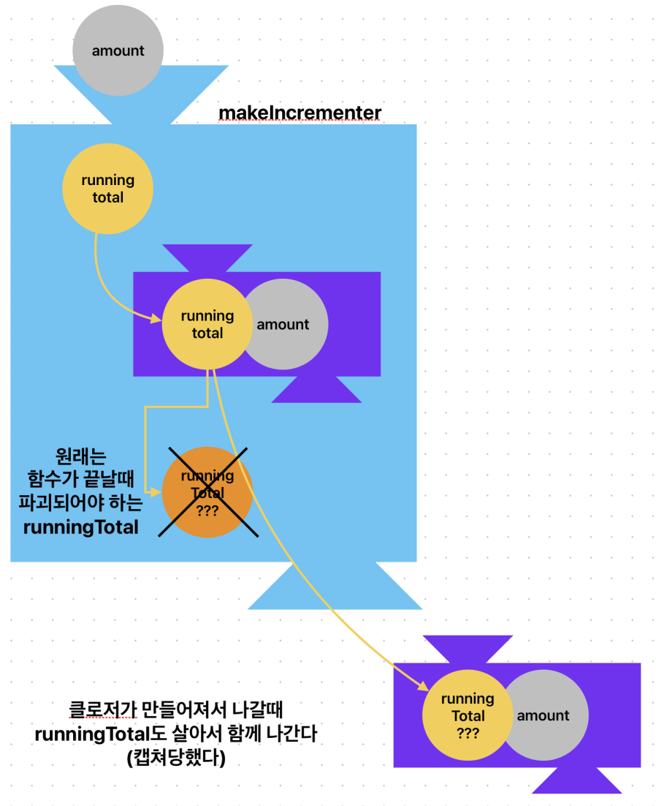

# Swift 클로저에서 값 캡처 (Capturing Values)

클로저는 자신을 둘러싼 외부 환경에 있는 변수나 상수를 "캡처"하여 내부에서 사용할 수 있습니다. 이렇게 캡처된 값을 "캡처값"이라고 합니다. 클로저는 캡처값을 마치 자신의 것처럼 자유롭게 사용하며, 캡처값의 변경도 가능합니다.

## 개념 설명

다음의 코드로 캡처값을 이해할 수 있습니다.

```swift
// makeIncrementer 함수는
// forIncrement 이름의 값을 받아서 내부에선 amount 상수로 활용하고
// () -> Int 타입의 클로저를 반환한다
func makeIncrementer(forIncrement amount: Int) -> () -> Int {
    var runningTotal = 0
    
    // 내부에서 클로저를 만들 수 있다!
    var incremnter = { () -> Int in
        runningTotal += amount
        return runningTotal
    }
    
    return incremnter
}

let incrementByTen: () -> Int = makeIncrementer(forIncrement: 10)

print(incrementByTen()) // 10
print(incrementByTen()) // 20
print(incrementByTen()) // 30

let incrementBySeven: () -> Int = makeIncrementer(forIncrement: 7)

print(incrementBySeven()) // 7
print(incrementBySeven()) // 14
```

위 내용은 다음 그림으로 다시 설명할 수 있습니다.




클로저는 참조타입입니다.

```swift
// 클로저는 참조타입

let alsoIncrementByTen: () -> Int = incrementByTen

print(alsoIncrementByTen()) // 40
print(incrementByTen()) // 50
```


## 캡처값 예시

```swift
func makeIncrementer(amount: Int) -> () -> Int {
    var runningTotal = 0
    func incrementer() -> Int {
        runningTotal += amount
        return runningTotal
    }
    return incrementer
}

let incrementByTen = makeIncrementer(amount: 10)
print(incrementByTen()) // 10
print(incrementByTen()) // 20
print(incrementByTen()) // 30
```

위 예시에서 `makeIncrementer` 함수는 클로저 `incrementer`를 반환합니다. `incrementer`는 외부 변수 `runningTotal`과 `amount`를 캡처하여 사용합니다. 

* `runningTotal`: 누적된 값을 저장하는 변수로, 클로저가 호출될 때마다 `amount`만큼 증가합니다.
* `amount`: `makeIncrementer` 함수에 전달된 값으로, 클로저가 호출될 때마다 `runningTotal`에 더해지는 값입니다.

`incrementByTen`은 `makeIncrementer` 함수를 호출하여 생성된 클로저입니다. `incrementByTen`을 호출할 때마다 `runningTotal`은 10씩 증가하며, 그 결과가 반환됩니다.

## 캡처값과 참조 타입

클로저가 참조 타입 (클래스, 배열 등)을 캡처하면, 참조 타입의 인스턴스 자체가 아니라 해당 인스턴스에 대한 참조를 캡처합니다. 따라서 클로저 내부에서 참조 타입의 값을 변경하면, 원본 인스턴스의 값도 변경됩니다.

```swift
class Counter {
    var count = 0
}

func incrementCounter(counter: Counter) -> () -> Int {
    func increment() -> Int {
        counter.count += 1
        return counter.count
    }
    return increment
}

let myCounter = Counter()
let increment = incrementCounter(counter: myCounter)
print(increment()) // 1
print(increment()) // 2
print(myCounter.count) // 2
```

위 예시에서 `incrementCounter` 함수는 `Counter` 클래스의 인스턴스 `myCounter`를 캡처합니다. `increment` 클로저가 호출될 때마다 `myCounter`의 `count` 프로퍼티가 증가하며, 이는 원본 인스턴스에도 반영됩니다.

