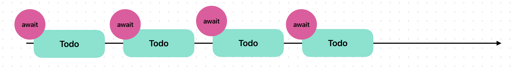
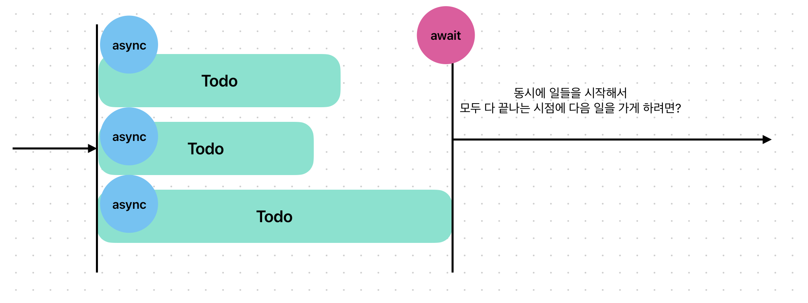

# 동시성(Concurrency)

[`DispatchQueue`](https://developer.apple.com/documentation/dispatch/dispatchqueue)를 활용하면 다양한 쓰레드에 일들을 맡겨서, 동시에 여러 일들이 벌어지게 할 수 있습니다.

```swift
func sayNed() {
    for index in 0...5 {
        sleep(2)
        print("\(index) : Tuna쌤의 도전을 받아들이겠습니다")
    }
}

func sayTuna() {
    for index in 0...5 {
        sleep(1)
        print("\(index) : Ned쌤은 저에게 안됩니다")
    }
}

func sayInyoung() {
    for index in 0...5 {
        sleep(3)
        print("\(index) : 인영님 고마워요")
    }
}


DispatchQueue.global(qos: .default).async {
    sayNed()
}

DispatchQueue.global(qos: .background).async {
    sayTuna()
}

DispatchQueue.global(qos: .background).async {
    sayInyoung()
}
```

하지만 함께 여행을 가려고 각자 집에서 준비한다면, 모든 멤버들이 준비가 끝날 때까지 출발할 수 없겠죠. 

```swift
// 여행 가기 전에 해야할 일들
let todos: [String] = ["여권", "세면도구", "옷", "충전기", "블루투스스피커", "보조배터리", "가방"]

func prepareTour(_ name: String, gap: UInt32) {
    for todo in todos {
        sleep(gap)
        print("[\(name)] \(todo) 챙겼어요")
    }
    
    print("[\(name)] 다 챙겼습니다")
}

DispatchQueue.global(qos: .default).async {
    prepareTour("Ned", gap: 3)
}

DispatchQueue.global(qos: .default).async {
    prepareTour("Tuna", gap: 2)
}

DispatchQueue.global(qos: .default).async {
    prepareTour("CH", gap: 1)
}
```

다음의 호출들은 제각각 URLSession들이 동시에 일을 벌이게 만들어서 출력 결과의 순서는 매번 달라집니다.

```swift
func getHTML(address: String) {
    if let url = URL(string: address) {
        let requst: URLRequest = URLRequest(url: url)
        
        // Singleton패턴으로 제공되는
        // URLSession 클래스에서 정의한
        // shared라는 타입 인스턴스
        URLSession.shared.dataTask(with: requst) { data, response, error in
            if let data {
                print("데이터 확인 완료: \(address) (\(data.count.formatted()) bytes)")
            } else {
                print("데이터 확인 실패: \(address)")
            }
        }.resume()
    } else {
        print("주소 확인 실패 : \(address)")
    }
}

getHTML(address: "https://naver.com")
getHTML(address: "https://daum.net")
getHTML(address: "https://techit.education")
getHTML(address: "https://swift.org")
getHTML(address: "https://apple.com")
```

그래서 순서에 맞춰 하나씩 일 처리하도록 Task 안에 await들로 처리해보았습니다.

```swift
func getHTML(address: String) async {
    if let url = URL(string: address) {
        let requst: URLRequest = URLRequest(url: url)
        
        do {
            let (data, _) = try await URLSession.shared.data(from: url)
            
            print("데이터 확인 완료: \(address) (\(data.count.formatted()) bytes)")
            
        } catch {
            print("데이터 확인 실패: \(address)")
        }
    } else {
        print("주소 확인 실패 : \(address)")
    }
}

Task {
    await getHTML(address: "https://naver.com")
    await getHTML(address: "https://daum.net")
    await getHTML(address: "https://techit.education")
    await getHTML(address: "https://swift.org")
    await getHTML(address: "https://apple.com")
}
```

위 코드의 진행을 그림으로 표현하면 다음과 같습니다.



하지만 위 방법으로는 컴퓨터의 성능을 다 활용할 수 없습니다. 웹사이트의 정보들을 가져오는 일은 동시에 실행해도 실행에는 문제가 없고, 오히려 시간을 아낄 수 있기 때문입니다. async와 await의 조합을 달리하면 해결 가능합니다.

```swift
func getHTML(address: String) async -> String {
    var message: String = ""
    
    if let url = URL(string: address) {
        let requst: URLRequest = URLRequest(url: url)
        
        do {
            let (data, _) = try await URLSession.shared.data(from: url)
            
            message = "데이터 확인 완료: \(address) (\(data.count.formatted()) bytes)"
            
            
        } catch {
            message = "데이터 확인 실패: \(address)"
        }
    } else {
        message = "주소 확인 실패 : \(address)"
    }
    
//    print(message)
    
    return message
}

// 동시에 모든 웹사이트 자료들을 가져와서, 모든 작업들이 다 완료되면 배열로 묶도록 기다리기
Task {
    async let message1 = getHTML(address: "https://naver.com")
    async let message2 = getHTML(address: "https://daum.net")
    async let message3 = getHTML(address: "https://techit.education")
    async let message4 = getHTML(address: "https://swift.org")
    async let message5 = getHTML(address: "https://apple.com")
    
    let messages: [String] = await [message1, message2, message3, message4, message5]
    
    for message in messages {
        print(message)
    }
}
```

다음의 그림은 위 코드의 진행방식을 보여줍니다.



## 참고자료

The Swift Programming Language (한국어)

- [동시성](https://bbiguduk.github.io/swift-book-korean/documentation/the-swift-programming-language-korean/concurrency)