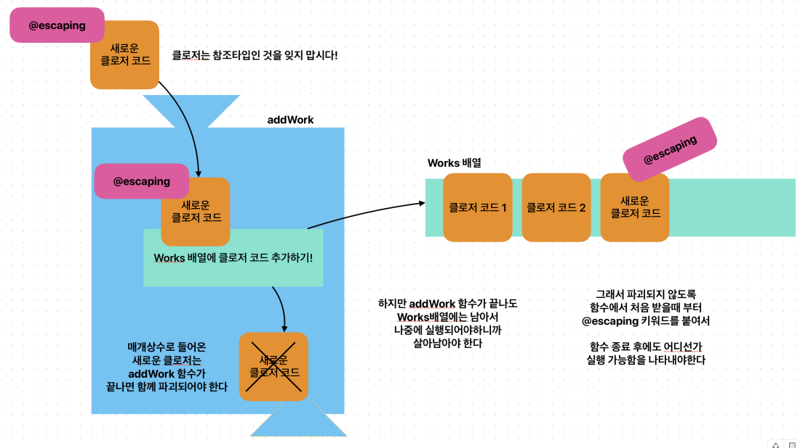

# 탈출 클로저 (Escaping Closures)

이전 강의에서 클로저는 자신이 정의된 함수가 종료되기 전에 호출되는 것을 살펴봤습니다. 하지만 Swift에서는 클로저가 함수가 종료된 후에도 실행될 수 있도록 허용하는 특별한 종류의 클로저를 제공하는데, 이를 "탈출 클로저 (Escaping Closure)"라고 합니다.

## 탈출 클로저의 개념

일반적으로 함수의 매개변수로 전달된 클로저는 함수 내부에서만 사용되고 함수가 종료되면 함께 사라집니다. 그러나 탈출 클로저는 함수 밖에서도 참조될 수 있도록 허용되어 함수가 종료된 후에도 실행될 수 있습니다.

## 탈출 클로저의 용도

탈출 클로저는 주로 비동기 작업이나 이벤트 처리와 같이 함수가 반환된 후에 실행되어야 하는 경우에 사용됩니다. 예를 들어, 네트워크 요청을 보내고 응답을 받는 작업, 타이머 이벤트 처리, 애니메이션 완료 후 작업 등에 활용될 수 있습니다.

## 탈출 클로저 예시

우선 클로저들을 배열에 담을 수 있다는 사실을 확인해봅니다.

```swift
func sayHello() {
    print("Hello World")
}

let sayHi: () -> Void = {
    print("Hi World")
}

// 할 일들을 배열에 쌓아봅시다
// 마치 Objective-C의 NSOperationQueue 같은 것도 만들 수 있겠네요.
let works: [() -> Void] = [sayHello, sayHi, sayHello, sayHi, sayHi]

// 배열에 지정된 특정 내용을 꺼내어 실행해봅시다

works.first?() // Hello World
works.last?() // Hi World

// 하나씩 꺼내어 실행해 봅시다

for work in works {
    work()
}

works.forEach { work in
    work()
}

/*
 Hello World
 Hi World
 Hello World
 Hi World
 Hi World
 */
 ```

그렇다면, 배열에 클로저를 추가하는 함수를 만들 수도 있겠지요. 우선 함수 바깥에 이미 이름 붙어 존재하는 클로저나 함수를 배열에 추가하도록 함수를 만들어봅시다.

```swift
func sayHello() {
    print("Hello World")
}

let sayHi: () -> Void = {
    print("Hi World")
}

let sayWelcome: () -> Void = {
    print("Welcome")
}

var works: [() -> Void] = [sayHello, sayHi]

// 할 일들을 추가로 배열에 쌓아주는 함수를 만듭시다
func addWork() {
    works.append(sayWelcome)
}

addWork()
addWork()
addWork()
addWork()
addWork()

for work in works {
    work()
}
```

이제, 배열에 새로운 클로저를 추가할 때, 호출부에서 임의의 클로저를 받아 추가할 수 있도록 합시다. 이 클로저들은 함수가 종료되어도 배열에 남아 실행 가능해야하지만 참조타입이기 때문에 문제가 됩니다. 그래서 `@escaping` 키워드를 통해 문제를 해결합니다.

```swift
var works: [() -> Void] = []

// 할 일들을 클로저로 받아서 배열에 쌓아주는 함수를 만듭시다
func addWork(work: @escaping () -> Void) {
    works.append(work)
}

addWork { print("Hello") }
addWork { print("Hi") }
addWork { print("Welcome") }

for work in works {
    work()
}
/*
 Hello
 Hi
 Welcome
 */
 ```


위 내용은 다음 그림으로 다시 설명할 수 있습니다.

 

## 탈출 클로저 선언

탈출 클로저는 함수 매개변수의 타입 앞에 `@escaping` 키워드를 붙여서 선언합니다.

```swift
func doSomethingLater(completion: @escaping () -> Void) {
    // 비동기 작업 수행 후 completion 클로저 호출
    DispatchQueue.main.asyncAfter(deadline: .now() + 2) {
        completion()
    }
}
```

위 예시에서 `doSomethingLater` 함수는 `completion`이라는 탈출 클로저를 매개변수로 받습니다. 함수 내부에서는 2초 후에 `completion` 클로저를 호출하여 비동기 작업 완료를 알립니다.

배열이 아니어도 특정 변수에 클로저를 할당할 때 `@escaping` 키워드는 유요합니다.

```swift
var myWork: () -> Void = {
    print("Hello")
}

myWork() // Hello

func setMyWork(work: @escaping () -> Void) {
    myWork = work
}

setMyWork(work: { print("Hi") })

myWork() // Hi

setMyWork { print("Welcome") }

myWork() // Welcome
```

## 탈출 클로저 사용

탈출 클로저를 사용하는 함수를 호출할 때는 클로저를 전달하고, 함수가 종료된 후에도 해당 클로저가 실행될 수 있도록 합니다.

```swift
doSomethingLater {
    print("비동기 작업이 완료되었습니다!")
}
print("함수 doSomethingLater가 종료되었습니다.")
```

위 예시에서 `doSomethingLater` 함수 호출 후 바로 "함수 doSomethingLater가 종료되었습니다."가 출력되지만, 2초 후에 탈출 클로저가 실행되어 "비동기 작업이 완료되었습니다!"가 출력됩니다.

## 탈출 클로저와 self 참조

탈출 클로저 내부에서 클래스 인스턴스의 프로퍼티나 메서드에 접근하려면 `self`를 명시적으로 사용해야 합니다. 이는 탈출 클로저가 클래스 인스턴스보다 오래 생존할 수 있기 때문에 발생하는 강한 순환 참조를 방지하기 위함입니다.

```swift
class MyClass {
    func doSomethingLater(completion: @escaping () -> Void) {
        DispatchQueue.main.asyncAfter(deadline: .now() + 2) {
            self.someProperty = 10 // self 명시적으로 사용
            completion()
        }
    }
}
```

## 탈출 클로저와 약한 참조 (Weak Reference)

탈출 클로저 내부에서 `self`를 약한 참조 (`weak self`)로 사용하면 강한 순환 참조를 방지할 수 있습니다. 약한 참조는 클래스 인스턴스가 해제될 때 자동으로 nil이 되므로, 메모리 누수를 방지할 수 있습니다.

```swift
class MyClass {
    func doSomethingLater(completion: @escaping () -> Void) {
        DispatchQueue.main.asyncAfter(deadline: .now() + 2) { [weak self] in
            self?.someProperty = 10 // 약한 참조 사용
            completion()
        }
    }
}
```

탈출 클로저는 비동기 작업이나 이벤트 처리와 같은 상황에서 유용하게 사용될 수 있는 강력한 도구입니다. 하지만 강한 순환 참조와 같은 문제를 일으킬 수 있으므로, `self` 참조와 약한 참조를 적절히 사용하여 메모리 관리에 주의해야 합니다.


## 참고자료

The Swift Programming Language (한국어)

- [클로저 (Closures) - 탈출 클로저 (Escaping Closures)](https://bbiguduk.github.io/swift-book-korean/documentation/the-swift-programming-language-korean/closures#탈출-클로저-Escaping-Closures)